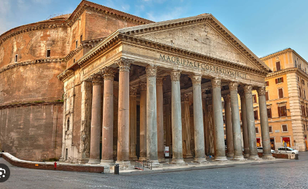

# Travel-Website-Assignment
<!DOCTYPE html>
<html>
<head>
    
    
        <h1 class="solid">- ITALY -</h1>
    
- Areas you must see! -

     
    <ul>
        <li class="one">Colosseum</li>
        <em>
Come and see the most iconic locations in Rome!The Roman Colosseum is known to be the most recognizable monument of the ancient Roman Empire. Today it is known for its astonishing architectural structre that dates backall the way from 70 CE
</em>
    
        

           
        
    
        
  
            <li class="two">Trevi Fountain</li>             
            <em>
The Trevi Fountain is the most popular fountain in the world! Built agaisnt the Palazzo Poli building. Make your wishes come true by tossing a coin faithfully into the fountain!
</em>
    
        

           
        
    
        
  
        <li class="three">Ludus Magnus</li>             
            <em>
The school of Galdiators! The Ludus Magnus was the training grounds of the legendary gladiators that faught friercely in the Roamn Colosseum. Visit now to explore its hidden tunnels and passageways to the Grand Colosseum!
</em>
    
        

           
        
    
        
  
        <li class="four">Pantheon</li>             
            <em>
The Pantheon was a great building made in 27 BC. Created as a dedication to the twelve rescepted gods of Rome. Alogn with the Colosseum, its architexture is also an astounding marvel to see. How it was built is still speculatted to this day. Come visit to see such a monument yourself!
</em>
    
        

           
        
    
        
  
        <li class="five">The Roman Forum</li>             
            
The Roman Forum is locaed at the very heart of Rome. Where much of its histroy was developed. The Forum was used for a variety of political and religious reasons and was the meeting place of the highest members of the Roman Society.

    
        

            <em></em>
        
    
    </ul>
